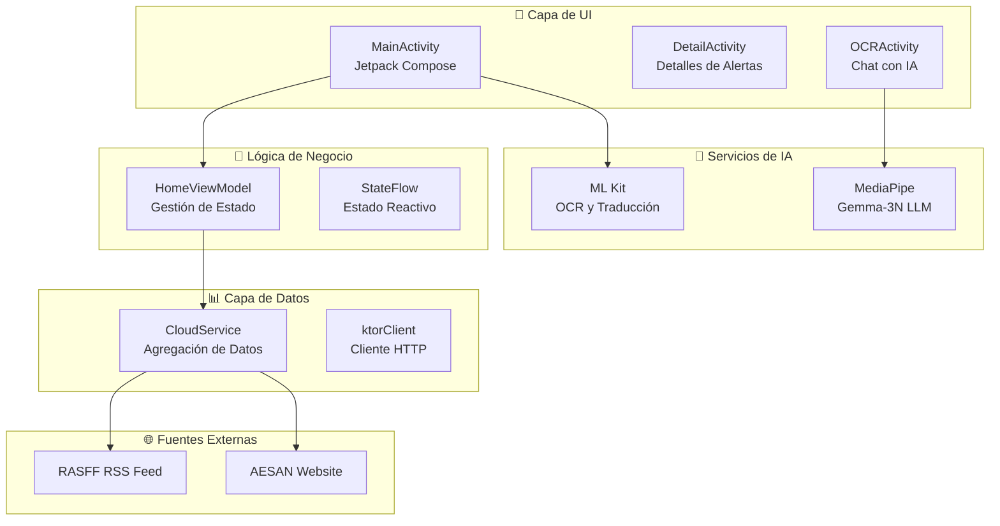

# 🚨 Food Alert App - Notificador de Alertas Alimentarias

<div align="center">


*Aplicación Android que agrega y traduce alertas alimentarias de fuentes europeas y españolas*

</div>

## 📋 Descripción

Food Alert App es una aplicación Android nativa desarrollada en Kotlin que proporciona acceso centralizado a alertas de seguridad alimentaria de múltiples fuentes oficiales. La aplicación integra tecnologías de IA para ofrecer funcionalidades avanzadas como OCR, chat multimodal y traducción automática.

### 🎯 Características Principales

- **📡 Agregación de Datos**: Recopila alertas de RASFF (UE) y AESAN (España)
- **🌐 Traducción Automática**: Traduce contenido usando ML Kit de Google
- **🤖 Chat con IA**: Interfaz conversacional con modelo Gemma-3N de MediaPipe
- **📸 OCR Inteligente**: Reconocimiento de texto en imágenes para búsquedas
- **🔍 Búsqueda Avanzada**: Filtrado en tiempo real con paginación
- **🔔 Notificaciones**: Alertas automáticas cada 12 horas
- **🎨 Material Design 3**: Interfaz moderna con Jetpack Compose

## 🏗️ Arquitectura del Sistema

La aplicación sigue una arquitectura por capas con separación clara de responsabilidades:



## 🚀 Tecnologías Utilizadas

### Core Android
- **Kotlin** - Lenguaje principal
- **Jetpack Compose** - UI moderna y declarativa
- **Material Design 3** - Sistema de diseño
- **StateFlow** - Gestión de estado reactiva

### Networking & Data
- **Ktor Client** - Cliente HTTP asíncrono
- **Ksoup** - Parsing de HTML/XML
- **WorkManager** - Procesamiento en segundo plano

### AI & ML
- **ML Kit** - OCR y traducción automática
- **MediaPipe** - Modelo LLM Gemma-3N para chat
- **Google Translate** - Servicios de traducción

## 📱 Funcionalidades Detalladas

### 🔍 Sistema de Búsqueda y Filtrado

La aplicación implementa búsqueda en tiempo real con capacidades avanzadas: [1](#0-0) 

- **Búsqueda reactiva** con StateFlow
- **Filtrado inteligente** que maneja plurales
- **Paginación automática** para grandes conjuntos de datos
- **Carga incremental** de contenido

### 🤖 Chat con IA Multimodal

La funcionalidad de chat permite interacciones con texto e imágenes: [2](#0-1) 

**Características del Chat:**
- Modelo **Gemma-3N** de MediaPipe
- Soporte para **imágenes y texto**
- Respuestas en **streaming** simulado
- Configuración optimizada para seguridad alimentaria

### 📸 Reconocimiento OCR

Integración con ML Kit para procesamiento de imágenes: [3](#0-2) 

- **Captura desde cámara** o galería
- **Extracción automática** de texto
- **Integración con búsqueda** para filtrado instantáneo
- **Limpieza de texto** con regex

### 📊 Agregación de Datos

El sistema recopila información de múltiples fuentes oficiales: [4](#0-3) 

**Fuentes de Datos:**
- **RASFF**: Feed RSS de alertas europeas
- **AESAN**: Scraping de sitio web español
- **Procesamiento asíncrono** con Ktor
- **Parsing inteligente** con Ksoup

## 🛠️ Configuración del Proyecto

### Prerrequisitos

- Android Studio Arctic Fox o superior
- SDK de Android 24+ (Android 7.0)
- Kotlin 1.8+
- Gradle 8.0+

### Instalación

1. **Clonar el repositorio**
```bash
git clone https://github.com/Gemeto/Food-Alert-App.git
cd Food-Alert-App
```

2. **Configurar dependencias**
```bash
./gradlew build
```

3. **Configurar permisos**
Asegurar que el archivo `AndroidManifest.xml` incluye:
```xml
<uses-permission android:name="android.permission.INTERNET" />
<uses-permission android:name="android.permission.CAMERA" />
```

4. **Ejecutar la aplicación**
```bash
./gradlew installDebug
```

## 📁 Estructura del Proyecto

```
app/src/main/java/id/gemeto/rasff/notifier/
├── 📊 data/
│   └── CloudService.kt          # Agregación de datos
├── 🎨 ui/
│   ├── HomeViewModel.kt         # Gestión de estado
│   └── view/
│       ├── MainActivity.kt      # Pantalla principal
│       ├── DetailActivity.kt    # Detalles de alertas
│       └── OCRActivity.kt       # Chat con IA
└── 📱 res/
    └── xml/
        └── path_provider.xml    # Configuración de archivos
```

## 🔧 Configuración Avanzada

### Modelo de IA

El modelo Gemma-3N debe ubicarse en:
```
/data/local/tmp/llm/gemma-3n-E2B-it-int4.task
```

Puedes ubicarlo manualmente con los siguientes comandos:
```
$ adb shell rm -r /data/local/tmp/llm/ # Remove any previously loaded models
$ adb shell mkdir -p /data/local/tmp/llm/
$ adb push output_path /data/local/tmp/llm/model_version.task
```

### WorkManager

Las notificaciones automáticas se configuran con: [5](#0-4) 

- **Intervalo**: 12 horas
- **Restricciones**: Solo con conexión de red
- **Política**: Mantener trabajo existente

## 🎨 Interfaz de Usuario

La aplicación utiliza **Material Design 3** con Jetpack Compose para una experiencia moderna: [6](#0-5) 

**Características de UI:**
- **Tema adaptativo** blanco/negro
- **Componentes Material 3** nativos
- **Animaciones fluidas** y transiciones
- **Diseño responsivo** para diferentes pantallas

## 🤝 Contribución

1. Fork el proyecto
2. Crear una rama para tu feature (`git checkout -b feature/AmazingFeature`)
3. Commit tus cambios (`git commit -m 'Add some AmazingFeature'`)
4. Push a la rama (`git push origin feature/AmazingFeature`)
5. Abrir un Pull Request

## 📄 Licencia

Este proyecto está bajo la Licencia MIT. Ver el archivo `LICENSE` para más detalles.

## 👥 Autores

- **Gemeto** - *Desarrollo principal* - [Gemeto](https://github.com/Gemeto)

## 🙏 Agradecimientos

- **RASFF** por proporcionar datos de alertas europeas
- **AESAN** por información de seguridad alimentaria española
- **Google** por ML Kit y MediaPipe
- **JetBrains** por Kotlin y herramientas de desarrollo

---

<div align="center">

**¿Encontraste útil esta aplicación? ¡Dale una ⭐ al repositorio!**

</div>
- [System Architecture (Gemeto/Food-Alert-App)](/wiki/Gemeto/Food-Alert-App#2)
- [OCR and AI Features (Gemeto/Food-Alert-App)](/wiki/Gemeto/Food-Alert-App#3.3)
